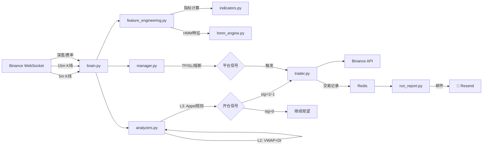

# ⚡ Q-Bot — SOL/USDT 短线 CTA 量化交易系统

基于 **ADX + VWAP + Appel 黄金规则** 三层过滤的加密货币短线 CTA（Commodity Trading Advisor）系统。  
支持 Binance 永续合约实时交易、历史回测、Redis 状态推送和邮件日报。

---

## 🎯 策略概述

### 交易标的
- **品种**: SOL/USDT 永续合约 (Binance)
- **主周期**: 5 分钟（信号生成） + 15 分钟（趋势过滤）
- **杠杆**: 10x（默认，范围 5x–10x）
- **数据源**: WebSocket 实时推送 (K线 + 深度 + 资金费率)

### 三层过滤信号模型

```
┌─────────────────────────────────────────────────┐
│  Layer 1 — ADX 趋势强度过滤                      │
│  ADX < 20 → 禁止开仓（仅极端BB+KDJ允许均值回归） │
│  ADX > 30 → 强趋势信号                           │
├─────────────────────────────────────────────────┤
│  Layer 2 — VWAP + DI 方向确认                    │
│  Price > VWAP && +DI > -DI → 只做多              │
│  Price < VWAP && -DI > +DI → 只做空              │
├─────────────────────────────────────────────────┤
│  Layer 3 — Appel 黄金规则精确入场                 │
│  做多: 快MACD(8,17) 金叉/直方图/背离 + ST确认     │
│  做空: 标准MACD(12,26) 死叉/直方图/背离 + ST确认  │
│  加强: 强趋势 + 5m/15m 双SuperTrend 一致          │
└─────────────────────────────────────────────────┘
```

### Layer 3 信号矩阵

| 信号 | 做多（快 MACD 8,17,9） | 做空（标准 MACD 12,26,9） |
|------|-------------------------|---------------------------|
| **A — 趋势** | 快MACD金叉 + 零线上方 + ST5m绿 | 标准MACD死叉 + 零线下方 + ST5m红 |
| **B — 动量** | 直方图转折↑ + KDJ<55 + ST5m绿 | 直方图转折↓ + KDJ>45 + ST5m红 |
| **C — 反转** | 看涨背离 + ADX>25 + KDJ<40 | 看跌背离 + ADX>25 + KDJ>60 |
| **D — 强势** | ADX>30 + 双ST绿 + BB<0.5 + KDJ<65 | ADX>30 + 双ST红 + BB>-0.5 + KDJ>35 |

### 技术指标矩阵

| 指标 | 参数 | 用途 |
|------|------|------|
| **ADX** | 14 | 趋势强度判断，< 20 震荡过滤 |
| **VWAP** | 288 (日内) | 方向确认，多空分界线 |
| **SuperTrend** | ATR=10, Mult=3 | 5m + 15m 双周期趋势 |
| **MACD (快)** | 8/17/9 | Appel 做多专用 |
| **MACD (标准)** | 12/26/9 | Appel 做空专用 + 背离 |
| **Bollinger Bands** | 20 周期, 2σ | 超买超卖 / 均值回归 |
| **KDJ** | 9/3/3 | 超买超卖过滤 |

### 风险管理

| 参数 | 值 | 说明 |
|------|-----|------|
| 止盈 | 1.2% 价格波动 | ≈ 12% 本金 (10x) |
| 止损 | 0.4% 价格反向 | ≈ 4% 本金 (10x) |
| 盈亏比 | 3:1 | 30% 胜率即正期望 |
| 仓位 | 5% 风险比 | 单笔目标净利 5% |
| 冷却 | 3 根 K 线 | 防止连续开仓 |
| 熔断 | 亏损 -10% → 暂停 24h | 分级冷却 |
| 资金费率 | > 0.05% 逆向禁止 | 防止逆费率开仓 |

---

## 📂 项目结构

```
q-bot/
├── run.py                          # 🚀 实盘入口 (支持命令行选择模式)
│
├── core/                           # 核心交易系统
│   ├── config/
│   │   ├── settings.py             # 全局配置 (杠杆/止盈止损/交易对/代理)
│   │   └── exchange.py             # 交易所连接 (REST + WebSocket 双通道)
│   │
│   ├── analysis/
│   │   ├── indicators.py           # 技术指标库 (BB/ST/MACD/KDJ/ADX/VWAP/动量/波动率)
│   │   └── feature_engineering.py  # 特征工程 (12维HMM特征 + 交易指标)
│   │
│   ├── models/
│   │   └── hmm_engine.py           # GMM-HMM 状态推理引擎 (5状态)
│   │
│   ├── strategy/
│   │   ├── analyzers.py            # 📊 策略信号生成 (ADX+VWAP+Appel三层过滤)
│   │   └── brain.py                # 策略大脑 (5m/15m双周期协调)
│   │
│   ├── risk/
│   │   ├── manager.py              # 风险管理 (TP/SL/熔断/冷却/时间防御)
│   │   └── position.py             # 仓位管理 (线程安全/敞口计算)
│   │
│   ├── engine/
│   │   ├── bot.py                  # 主循环 (WebSocket→分析→交易→Redis心跳)
│   │   └── trader.py               # 交易执行器 (下单/持仓管理/平仓)
│   │
│   ├── ui/
│   │   ├── display.py              # 终端UI (实时状态栏/开平仓日志)
│   │   └── input.py                # 键盘监听 (跨平台/IDE兼容)
│   │
│   └── utils/
│       ├── logging_config.py       # 日志配置 (文件+终端双输出)
│       └── reporting.py            # 交易报告 (HTML/CSV/Redis推送)
│
├── backtest/                       # 回测与模型训练
│   ├── backtester.py               # 📈 统一回测引擎 (复用core模块)
│   ├── GMMHMM.py                   # GMM-HMM 模型训练 (5状态12维特征)
│   ├── HF.py                       # H∞滤波器回测实验
│   ├── kmeans.py                   # K-Means 聚类回测实验
│   └── outputs/                    # 回测结果输出 (图表/CSV)
│
├── scripts/
│   ├── pretrain.py                 # 模型预热 (异步拉取数据, 预填充指标)
│   └── run_report.py               # 邮件报告定时任务 (Resend API)
│
└── logs/                           # 运行日志
```

---

## 🚀 快速开始

### 1. 环境配置

```bash
pip install ccxt pandas numpy hmmlearn joblib colorama python-dotenv websocket-client redis matplotlib
```

在项目根目录创建 `.env` 文件：

```env
BINANCE_API_KEY=your_api_key
BINANCE_SECRET=your_secret_key
```

### 2. 训练 HMM 模型

```bash
python backtest/GMMHMM.py
```

训练完成后会在 `backtest/` 目录下生成模型文件 `.pkl` 和状态分布图 `.png`。

### 3. 回测验证

```bash
# 基础回测 (默认拉取50万根1分钟K线)
python backtest/backtester.py --symbol SOL/USDT --balance 100

# 指定日期范围
python backtest/backtester.py --symbol SOL/USDT --since "2025-01-01" --end "2025-02-01"

# 最近N天
python backtest/backtester.py --symbol SOL/USDT --lookback-days 30
```

回测结果输出到 `backtest/outputs/` 目录，包含资金曲线图和交易明细 CSV。

### 4. 预热模型

```bash
python scripts/pretrain.py
```

异步拉取最近 1000 根 1m + 300 根 15m K 线，预填充技术指标缓存。

### 5. 启动实盘

```bash
python run.py          # 交互式选择模式
python run.py 1        # 直接进入模式1
python run.py 2        # 直接进入模式2
```

### 6. 启动邮件报告 (可选)

```bash
python scripts/run_report.py
```

每日 11:00 / 23:00 自动发送交易报告邮件，支持 CSV 附件。

---

## 📊 数据流



---

## ⚙️ 核心参数调整

所有参数集中在 `core/config/settings.py`：

```python
# 交易标的
SYMBOL = 'SOL/USDT'
TIMEFRAME_SIGNAL = '5m'    # 信号周期
TIMEFRAME_TREND  = '15m'   # 趋势过滤周期

# 杠杆
DEFAULT_LEVERAGE = 10.0
MIN_LEVERAGE = 5.0
MAX_LEVERAGE = 10.0

# 止盈止损
MIN_TP_DISTANCE = 0.012    # 1.2% 价格波动 (10x → 12% 本金)
MAX_SL_DISTANCE = 0.004    # 0.4% 价格反向 (10x → 4% 本金)

# 手续费
TAKER_FEE_RATE = 0.0005    # Binance Taker 0.05%
FEE_BUFFER_PCT = 0.0012    # 手续费缓冲

# 资金费率
MAX_FUNDING_RATE_THRESHOLD = 0.0005  # 逆向费率阈值
```

策略信号阈值在 `core/strategy/analyzers.py`：

```python
ADX_TREND  = 20    # ADX趋势阈值 (以下为震荡)
ADX_STRONG = 30    # ADX强趋势阈值
```

---

## 🏗️ 架构特点

- **双周期协调**: 5m 生成信号，15m SuperTrend 过滤噪音
- **Appel 黄金规则**: 快 MACD(8,17) 做多、标准 MACD(12,26) 做空的不对称设计
- **线程安全**: `PositionManager` 使用锁保护多线程读写
- **跨平台终端**: 键盘监听兼容 Windows (msvcrt) / Unix (termios) / IDE 环境
- **Redis 心跳**: 实时推送运行状态，供外部监控和报告系统消费
- **分级熔断**: 亏损 -10% 暂停 24h，-20% 暂停 48h
- **回测复用**: 回测引擎直接复用 `core/` 的 `StrategyBrain` 和 `RiskManager`

---

## 🔧 针对 SOLUSDT 永续短线策略的改进建议（不改变现有核心策略）

以下建议均为 **结构化增强 / 执行层优化**，不改变 ADX+VWAP+Appel 三层信号本体：

1. **交易时段白名单（执行层）**
   - 建议将 UTC 00:00–03:00、12:00–16:00（流动性相对更好）作为主交易窗口。
   - 低流动性时段仅允许 A/D 级强信号，降低滑点与假突破。

2. **波动分层仓位（风控层）**
   - 在固定 20% 名义仓位基础上，引入 `ATR%` 档位缩放（如高波动降至 12%–15%）。
   - 信号逻辑不变，只调整同信号下的名义仓位，减少高波动回撤。

3. **资金费率“缓冲区”机制（过滤层）**
   - 目前采用单阈值过滤，可加“软阈值”区间（例如 70%–100% 阈值范围）降低杠杆。
   - 超阈值仍禁止，未超阈值但接近上限时降低杠杆，提升稳定性。

4. **订单簿质量门控（执行层）**
   - 开仓前增加 `spread_pct` 与 top-of-book 深度门限检查。
   - 可显著降低 SOL 在突发行情时“信号正确但成交劣化”的问题。

5. **分批止盈（出场层）**
   - 保留现有 TP/SL 体系，新增可选：0.8% 先减仓 30% + 余仓跟踪止盈。
   - 逻辑上仍是趋势延续，只是对冲 SOL 常见的尖峰回吐。

6. **回测指标补充（评估层）**
   - 除胜率与收益，建议固定输出：`MFE/MAE`、分时段 Sharpe、滑点敏感性、资金费率归因。
   - 可快速识别策略在 SOL 上“赚在何时、亏在何种微结构”。

7. **参数稳健性验证（研究层）**
   - 对 `MIN_TP_DISTANCE`、`MAX_SL_DISTANCE`、`ADX` 阈值做 walk-forward 网格稳定性测试。
   - 重点观察“参数平台区”而非单点最优，避免过拟合近期 SOL 行情。
